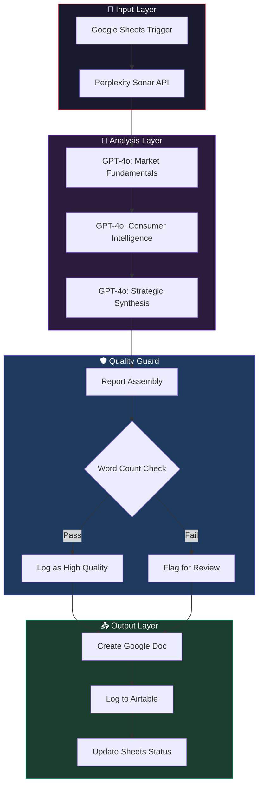

# 🏗️ Architecture — Market Research Pipeline

> A deep-dive into the technical design, data flow, and prompt engineering strategy behind the automated market research pipeline using Perplexity and GPT-4o.

---

## Table of Contents

- [System Overview](#system-overview)
- [Data Flow](#data-flow)
- [Node-by-Node Breakdown](#node-by-node-breakdown)
- [Prompt Chaining Strategy](#prompt-chaining-strategy)
- [Error Handling](#error-handling)
- [Design Decisions](#design-decisions)

---

## System Overview

The pipeline is a **12-module n8n workflow** that transforms a Google Sheets trigger into a structured, multi-stage market intelligence report. It combines **real-time web intelligence** (Perplexity Sonar) with **tier-1 LLM synthesis** (OpenAI GPT-4o) through a sequential, state-building architecture.



---

## Data Flow

```
Trigger: New Row in Google Sheets (Industry + Geography)
         │
         ▼
┌─────────────────────────────────┐
│  Perplexity Sonar API           │
│  Real-time Market Data Layer    │
│  (Size, Players, Trends, Risks) │
└─────────────────────────────────┘
         │
         ▼
┌─────────────────────────────────┐
│  GPT-4o Call #1                 │   Sections 1–3
│  Market Fundamentals            │   Overview, Size, Competition
└─────────────────────────────────┘
         │
         ▼
┌─────────────────────────────────┐
│  GPT-4o Call #2                 │   Sections 4–6
│  Consumer Intelligence          │   Drivers, Risks, Behavior
└─────────────────────────────────┘
         │
         ▼
┌─────────────────────────────────┐
│  GPT-4o Call #3                 │   Section 7
│  Strategic Synthesis            │   12-Month Outlook, C-Suite Sum
└─────────────────────────────────┘
         │
         ▼
┌─────────────────────────────────┐
│  Quality Gate & Delivery        │
│  Doc Creation + Status Update   │──→  📄 GDocs + 📊 Sheets
└─────────────────────────────────┘
```

---

## Node-by-Node Breakdown

### 1. Google Sheets Trigger
Polls a specific Google Sheet every minute for new rows. Inputs required: `Industry`, `Geography`, and `Depth`.

### 2. Perplexity — Live Web Search
Uses the `sonar` model to pull **real-time factual data**. This serves as the ground truth for all subsequent analysis, eliminating LLM hallucinations regarding market figures.

### 3–5. GPT-4o Synthesis Chain
A sequential chain where each call inherits the context of the previous ones. This progressive refinement ensures the 3000-word report remains cohesive and avoids repetition.

### 7. Quality Gate (Word Count)
An `If` node that validates if the generated content meets the minimum word threshold (700 words). Reports failing this check are flagged in the final delivery for manual oversight.

### 10–12. Persistence Layer
The pipeline creates a formatted **Google Doc**, logs the metadata to **Airtable**, and updates the original **Google Sheet** with a "✅ Complete" status and the final report link.

---

## Design Decisions

### 1. Perplexity over Standard Search
Perplexity Sonar provides "Search-to-Context" capability, returning a synthesized answer with citations rather than raw URLs, which significantly improves LLM reasoning quality.

### 2. GPT-4o for Synthesis
GPT-4o was selected for its superior instruction-following and ability to maintain consistent persona (Senior Consulting Analyst) across a long multi-stage chain.

### 3. Integrated Quality Gate
The word count gate ensures that "Zero-Touch" automation doesn't result in "Zero-Value" thin content. It forces a human-in-the-loop review for complex or niche industries where data might be sparse.
