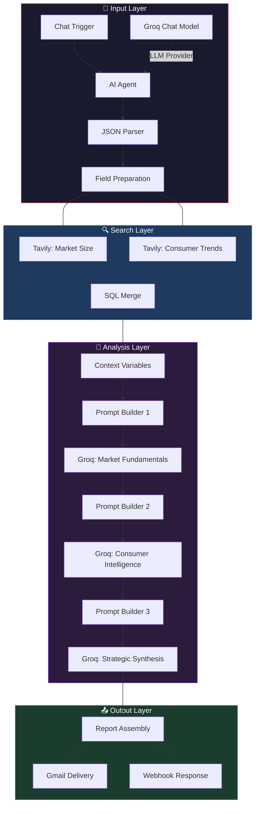
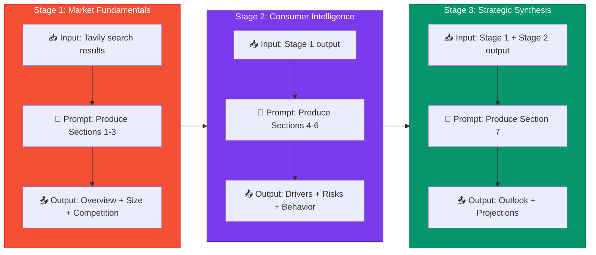

<div align="center">
  

  **Technical Deep-Dive into the n8n Market Research Pipeline powered by AI Agents & Groq.**
</div>

---

## Table of Contents

- [System Overview](#system-overview)
- [Data Flow](#data-flow)
- [Node-by-Node Breakdown](#node-by-node-breakdown)
- [Prompt Chaining Strategy](#prompt-chaining-strategy)
- [Error Handling](#error-handling)
- [Design Decisions](#design-decisions)

---

## System Overview

The pipeline is a **16-node n8n workflow** that transforms a natural language query (e.g., *"Electric vehicles in India"*) into a structured 7-section market research report. It combines **real-time web intelligence** (Tavily) with **LLM analytical reasoning** (Groq + LLaMA 3.3 70B) through a sequential, context-building architecture.



---

## Data Flow

```
User Input: "Electric vehicles in India"
         │
         ▼
┌─────────────────────────────────┐
│  AI Agent (Groq LLaMA 3.3)     │
│  Output: {"industry": "Electric │
│  vehicles", "geography":"India"} │
└─────────────────────────────────┘
         │
         ├──────────────────────────────┐
         ▼                              ▼
┌─────────────────────┐  ┌──────────────────────────┐
│ Tavily Search #1    │  │ Tavily Search #2         │
│ "EV market size     │  │ "EV consumer trends      │
│  revenue players    │  │  behavior India 2025"    │
│  India 2025"        │  │                          │
│ → 5 results + AI    │  │ → 5 results + AI         │
│   summary           │  │   summary                │
└─────────────────────┘  └──────────────────────────┘
         │                              │
         └──────────┬───────────────────┘
                    ▼
         ┌─────────────────────┐
         │  SQL CROSS JOIN     │
         │  Merged context     │
         └─────────────────────┘
                    │
                    ▼
         ┌─────────────────────┐
         │  Groq Call #1       │   Sections 1-3
         │  Market Fundamentals│   Overview, Size, Competition
         └─────────────────────┘
                    │
                    ▼
         ┌─────────────────────┐
         │  Groq Call #2       │   Sections 4-6
         │  Consumer Intel     │   Drivers, Risks, Behavior
         └─────────────────────┘
                    │
                    ▼
         ┌─────────────────────┐
         │  Groq Call #3       │   Section 7
         │  Strategic Synthesis│   Outlook, Projections, C-Suite
         └─────────────────────┘
                    │
                    ▼
         ┌─────────────────────┐
         │  HTML Assembly      │
         │  Full Report        │──→  📧 Gmail  +  🔗 Webhook
         └─────────────────────┘
```

---

## Node-by-Node Breakdown

### 1. Chat Trigger (`When chat message received`)

| Property | Value |
|----------|-------|
| Type | `@n8n/n8n-nodes-langchain.chatTrigger` |
| Version | 1.4 |
| Public | `true` |

The entry point of the pipeline. Accepts a natural language message via n8n's built-in chat widget or webhook endpoint.

---

### 2. AI Agent (`AI Agent`)

| Property | Value |
|----------|-------|
| Type | `@n8n/n8n-nodes-langchain.agent` |
| LLM | Groq LLaMA 3.3 70B |
| System Prompt | *"Extract industry and geography from the user message. Respond with ONLY this JSON, nothing else: {"industry": "...", "geography": "..."}"* |

Uses a constrained system prompt to extract exactly two fields from free-text. The strict JSON-only instruction ensures reliable parsing downstream.

---

### 3. JSON Parser (`Code in JavaScript`)

```javascript
const raw = $input.first().json.output;
const match = raw.match(/\{[\s\S]*\}/);
if (!match) throw new Error('No JSON found in agent output: ' + raw);
const parsed = JSON.parse(match[0]);
return [{ json: { industry: parsed.industry.trim(), geography: parsed.geography.trim() } }];
```

Extracts JSON from the AI agent's response using regex. Handles cases where the LLM wraps JSON in additional text.

---

### 4. Field Preparation (`Edit Fields`)

Structures the extracted data and pre-builds Tavily search queries:
- `tavily_query_1`: `"{industry} market size revenue players {geography} 2025"`
- `tavily_query_2`: `"{industry} consumer trends behavior {geography} 2024 2025"`

---

### 5a. Tavily — Market Size & Players

| Property | Value |
|----------|-------|
| Endpoint | `POST https://api.tavily.com/search` |
| Search Depth | `advanced` |
| Max Results | `5` |
| Include Answer | `advanced` |
| Topic | `general` |

Retrieves market sizing data, key players, and revenue figures.

---

### 5b. Tavily — Trends & Consumer Data

Same configuration as 5a but with a trend-focused query. Both searches run **in parallel** for speed.

---

### 6. Merge Results (`SQL CROSS JOIN`)

Combines both Tavily results using an SQL cross join, creating a unified context object. This ensures both data streams are available to all downstream nodes.

---

### 7–9. Three-Stage Groq LLM Chain

See [Prompt Chaining Strategy](#prompt-chaining-strategy) below.

---

### 10. Report Assembly (`Assembly Full Report`)

A JavaScript Code node that:
1. Collects output from all three Groq calls
2. Converts Markdown to HTML using regex-based transformation
3. Wraps the report in styled HTML with branded headers
4. Outputs `full_report_html`, `industry`, and `Geography`

---

### 11. Gmail Delivery + Webhook Response

The assembled report is sent to **two parallel outputs**:
- **Gmail**: HTML email with subject line `"{industry} Market Research — {Geography}"`
- **Webhook**: Full JSON response for API integrations

---

## Prompt Chaining Strategy

The pipeline uses **progressive context accumulation** — each LLM call receives the output of the previous call as additional context:



### Why Chain Instead of Single Call?

| Approach | Pros | Cons |
|----------|------|------|
| **Single prompt** | Simpler | Token overflow, inconsistent structure, weak synthesis |
| **3-stage chain** ✅ | Better quality, progressive refinement, reliable structure | 3× API calls (mitigated by Groq's speed) |

### LLM Configuration

| Parameter | Value | Rationale |
|-----------|-------|-----------|
| Model | `llama-3.3-70b-versatile` | Best balance of quality and speed on Groq |
| Temperature | `0.3` | Low creativity — prioritizes factual accuracy |
| Max Tokens | `800` | Prevents verbose output, forces conciseness |
| System Role | Senior market research analyst | Establishes domain expertise and anti-hallucination guardrails |

---

## Error Handling

| Mechanism | Implementation |
|-----------|---------------|
| **API Resilience** | All HTTP Request nodes use `neverError: true` — the workflow continues even if an API call fails |
| **JSON Parsing Safety** | Regex-based JSON extraction with explicit error throws and context messages |
| **Prompt Guardrails** | Strict section headers, word limits, and format instructions prevent unparseable LLM output |
| **Idempotency** | Each run is stateless — failed runs can be safely retried |

---

## Design Decisions

### 1. Tavily over Perplexity/SerpAPI

- **Tavily's `include_answer: advanced`** provides an AI-synthesized summary alongside raw results — reducing the need for an extra LLM call to summarize search results
- Native JSON response format eliminates scraping/parsing overhead

### 2. Groq over OpenAI/Anthropic

- **Inference speed**: Groq processes LLaMA 3.3 70B at ~500 tokens/second — enabling sub-60s total pipeline execution
- **Cost**: Groq's free tier is more generous for prototyping
- **Quality**: LLaMA 3.3 70B's analytical capabilities match GPT-4-class performance for structured market analysis

### 3. SQL CROSS JOIN for Merging

Using n8n's built-in SQL merge (rather than a Code node) ensures:
- Declarative data combination
- Consistent behavior regardless of result ordering
- Easy extensibility if more data sources are added

### 4. Markdown-to-HTML in Assembly

The final report uses a lightweight regex-based Markdown→HTML converter rather than a library:
- Zero dependencies
- Handles the specific subset of Markdown the LLM produces
- Produces clean, email-compatible HTML
