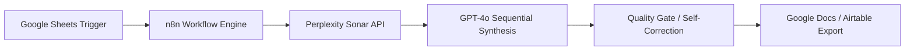

# Automated Market Research AI Pipeline

  

  **Enterprise-Grade AI Automation for Market Intelligence powered by n8n, Llama-3.1, and Perplexity Search API.**

  

    
    
    
    
    
  

---

### 🚀 Overview
A production-grade AI automation pipeline built with **n8n**, **OpenAI GPT-4o**, and **Perplexity Sonar API**. This system transforms a simple Google Sheets trigger into a structured, multi-stage market intelligence report in under 60 seconds.

### ✨ Key Results
- ⏱️ **Speed**: <60 seconds for a full 7-section report.
- 📉 **Efficiency**: 90% reduction in manual research effort.
- 🧪 **Scalability**: Integrated with Google Sheets and Airtable for zero-touch batch processing.
- 🕵️ **Real-time Accuracy**: Powered by Perplexity Sonar for zero-hallucination web intelligence.

---

### 🏗️ Architecture

---

### 🛠️ Technology Stack
- **Orchestration**: n8n (Production Automation)
- **Large Language Model**: OpenAI GPT-4o
- **Real-time Search**: Perplexity Sonar API
- **Data Persistence**: Google Docs, Airtable, Google Sheets

---

### 📊 Features
- **Multi-Stage Synthesis**: Goes beyond simple summarization to provide fundamental analysis, consumer intelligence, and executive synthesis.
- **Auto-Formatting**: Deliver reports directly to Google Docs with professional heading structures.
- **Logging & Persistence**: Every research run is logged into Airtable for historical tracking and audit.
- **Self-Correction**: Integrated If/Else quality gates to ensure high-fidelity outputs.

---

### 📋 Sample Report Structure

1. **Executive Summary**
2. **Market Fundamentals**
3. **Consumer Intelligence**
4. **Competitive Landscape**
5. **Technological Trends**
6. **Risk Assessment**
7. **Actionable Recommendations**

---

### 💻 Local Setup
1. **Import Workflow**: Import the provided `.json` workflow into your n8n instance.
2. **Set Credentials**: Link your Groq, Perplexity, and Google Workspace APIs.
3. **Trigger**: Add a new row to your Google Sheet to initiate the pipeline.

---

  
  

