<div align="center">

# 🔍 Market Research Pipeline

### AI-Powered Market Intelligence — Automated with n8n, Tavily & Groq

[](LICENSE)
[](https://n8n.io)
[](https://tavily.com)
[](https://groq.com)
[](https://ai.meta.com/llama/)

*Type an industry + geography → receive a structured, 7-section executive market report in your inbox within 60 seconds.*

[📖 Architecture](#architecture) · [🚀 Quick Start](#quick-start) · [📊 Sample Output](#sample-output) · [📚 Docs](docs/)

</div>

---

## ✨ Key Features

| Feature | Description |
|---|---|
| 🧠 **AI Intent Extraction** | Natural language input → automatic industry & geography detection via Groq LLaMA 3.3 |
| 🌐 **Dual Web Intelligence** | Parallel Tavily searches for market sizing + consumer trends with advanced search depth |
| 🔗 **3-Stage LLM Chain** | Market Fundamentals → Consumer Intelligence → Strategic Synthesis — each stage builds on the last |
| 📧 **Auto-Delivery** | Formatted HTML report delivered to Gmail + webhook response for integrations |
| ⚡ **Sub-60s Execution** | Full pipeline from prompt to report in under a minute using Groq's blazing-fast inference |
| 🛡️ **Production-Grade** | Error handling with `neverError` flags, structured prompt engineering, deterministic outputs |

---

## 🏗️ Architecture

```mermaid
flowchart LR
    A["💬 Chat Trigger"] --> B["🤖 AI Agent\n(Intent Extraction)"]
    B --> C["⚙️ Parse & Prepare\nFields"]
    C --> D["🔍 Tavily Search\n(Market Size)"]
    C --> E["🔍 Tavily Search\n(Trends)"]
    D --> F["🔀 Merge Results"]
    E --> F
    F --> G["📊 Groq LLM\n(Market Fundamentals)"]
    G --> H["🧠 Groq LLM\n(Consumer Intel)"]
    H --> I["🎯 Groq LLM\n(Strategic Synthesis)"]
    I --> J["📋 Report Assembly"]
    J --> K["📧 Gmail Delivery"]
    J --> L["🔗 Webhook Response"]

    style A fill:#1a1a2e,stroke:#e63946,color:#fff
    style B fill:#16213e,stroke:#0f3460,color:#fff
    style C fill:#16213e,stroke:#0f3460,color:#fff
    style D fill:#4F46E5,stroke:#3730A3,color:#fff
    style E fill:#4F46E5,stroke:#3730A3,color:#fff
    style F fill:#1a1a2e,stroke:#e63946,color:#fff
    style G fill:#F55036,stroke:#DC2626,color:#fff
    style H fill:#F55036,stroke:#DC2626,color:#fff
    style I fill:#F55036,stroke:#DC2626,color:#fff
    style J fill:#1a1a2e,stroke:#e63946,color:#fff
    style K fill:#059669,stroke:#047857,color:#fff
    style L fill:#059669,stroke:#047857,color:#fff
```



### Pipeline Stages

| Stage | Node | Purpose |
|-------|------|---------|
| **1. Input** | Chat Trigger | Receives natural language query (e.g., *"Electric vehicles in India"*) |
| **2. Extract** | AI Agent + Groq | Extracts `industry` and `geography` from free-text input |
| **3. Search** | 2× Tavily API | Parallel advanced web searches for market data + consumer trends |
| **4. Merge** | SQL Cross Join | Combines both Tavily search results into unified context |
| **5. Analysis** | 3× Groq LLM Calls | Chained analysis: Fundamentals → Consumer Intel → Strategic Synthesis |
| **6. Assembly** | Code Node | Merges all sections into formatted HTML report |
| **7. Delivery** | Gmail + Webhook | Sends report via email and returns via API |

> 📖 For a deep-dive into each node, see **[ARCHITECTURE.md](ARCHITECTURE.md)**

---

## 🚀 Quick Start

### Prerequisites

- [n8n](https://n8n.io) (self-hosted or cloud)
- [Tavily API Key](https://tavily.com) — free tier available
- [Groq API Key](https://console.groq.com) — free tier available
- Gmail account with OAuth2 configured in n8n

### Setup

```bash
# 1. Clone the repository
git clone https://github.com/RishabJainhub/market-research-pipeline.git
cd market-research-pipeline

# 2. Copy environment template
cp .env.example .env

# 3. Add your API keys to .env
# TAVILY_API_KEY=tvly-your-key-here
# GROQ_API_KEY=gsk_your-key-here
```

```bash
# 4. Import the workflow into n8n
#    Open n8n → Workflows → Import from File → select workflow.json

# 5. Update credentials in n8n
#    Replace placeholder API keys in each HTTP Request node

# 6. Activate the workflow and test!
```

> 📖 For detailed step-by-step instructions, see **[docs/setup-guide.md](docs/setup-guide.md)**

---

## 📊 Sample Output

<details>
<summary><b>📄 Electric Vehicles — India (click to expand)</b></summary>

### Section 1 — Market Overview
India's electric vehicle market encompasses battery electric vehicles (BEVs), hybrid electric vehicles (HEVs), and plug-in hybrid electric vehicles (PHEVs) across two-wheeler, three-wheeler, passenger car, and commercial vehicle segments. The market is distinguished by its **dominance of two- and three-wheelers** (which account for over 90% of EV sales) and **strong government policy support** through the FAME II subsidy scheme and state-level incentives.

### Section 2 — Market Size
- **TAM**: $7.1 billion (2025), projected to reach $113.99 billion by 2029 at a CAGR of 66.52%
- **SAM**: $3.2 billion — BEV two-wheelers and three-wheelers *(High confidence)*
- **SOM**: $450 million — urban metro markets with charging infrastructure *(Medium confidence)*

### Section 3 — Competitive Landscape
| Player | Share/Revenue | Primary Advantage | Vulnerability |
|--------|-------------|-------------------|---------------|
| Tata Motors | ~70% passenger EV share | First-mover, Nexon EV brand recognition | Narrow model range |
| Ola Electric | ~35% e-scooter share | Vertical integration, Gigafactory | Quality/service complaints |
| TVS Motor | ~18% e-scooter share | Legacy dealer network | Late EV entry |
| Ather Energy | ~12% e-scooter share | Premium positioning, own charging grid | Limited geographic reach |
| MG Motor (SAIC) | ~8% passenger EV share | Competitive pricing, ZS EV | Import dependency |

*... [7 sections total including Growth Drivers, Barriers & Risks, Consumer Intelligence, and Strategic Outlook]*

</details>

> 📖 Full sample reports available in **[samples/](samples/)**

---

## 🛠️ Tech Stack

| Component | Technology | Role |
|-----------|-----------|------|
| **Orchestration** | [n8n](https://n8n.io) | Workflow automation & node execution |
| **Web Search** | [Tavily API](https://tavily.com) | Real-time market data retrieval |
| **LLM Inference** | [Groq](https://groq.com) | Ultra-fast LLM API (< 500ms/call) |
| **Language Model** | [LLaMA 3.3 70B](https://ai.meta.com/llama/) | Market analysis & synthesis |
| **Intent Parsing** | n8n AI Agent | Natural language → structured fields |
| **Delivery** | Gmail API | Formatted HTML report delivery |

---

## 🧠 Prompt Engineering

The pipeline uses a **3-stage progressive prompt chain** where each LLM call builds on the output of the previous one:

```
Stage 1: Market Fundamentals    → Sections 1-3 (Overview, Sizing, Competition)
Stage 2: Consumer Intelligence  → Sections 4-6 (Drivers, Risks, Consumer Shifts)
Stage 3: Strategic Synthesis    → Section 7   (Outlook, Projections, C-Suite Summary)
```

Each prompt is carefully engineered with:
- **Strict section headers** for deterministic parsing
- **Word count limits** (500 / 500 / 300 words) for concise output
- **System role**: *"Senior market research analyst — be precise, never fabricate statistics"*
- **Temperature 0.3** for factual, low-creativity output

> 📖 Full prompt documentation in **[docs/prompt-engineering.md](docs/prompt-engineering.md)**

---

## 📁 Repository Structure

```
market-research-pipeline/
├── README.md                     # You are here
├── ARCHITECTURE.md               # Deep-dive technical documentation
├── LICENSE                       # MIT License
├── .env.example                  # API key template
├── .gitignore                    # Git ignore rules
├── workflow.json                 # n8n workflow (keys redacted)
├── docs/
│   ├── setup-guide.md            # Step-by-step setup instructions
│   ├── api-reference.md          # API endpoint documentation
│   └── prompt-engineering.md     # LLM prompt design rationale
├── samples/
│   ├── electric-vehicles-india.md    # Sample report
│   └── fintech-uk.md                # Sample report
└── evaluation/
    └── evaluation-report.md      # Pipeline evaluation results
```

---

## 🤝 Contributing

Contributions are welcome! Here's how you can help:

1. **Fork** the repository
2. **Create** a feature branch (`git checkout -b feature/amazing-feature`)
3. **Commit** your changes (`git commit -m 'Add amazing feature'`)
4. **Push** to the branch (`git push origin feature/amazing-feature`)
5. **Open** a Pull Request

### Ideas for Contribution
- Add more sample industry reports
- Integrate additional data sources (e.g., Crunchbase, Statista)
- Add a quality-gate module with automated scoring
- Build a web UI frontend for the pipeline

---

## 📄 License

This project is licensed under the MIT License — see the [LICENSE](LICENSE) file for details.

---

## 👤 Author

**Rishab Jain** — [GitHub](https://github.com/RishabJainhub)

---

<div align="center">

*Built with ❤️ using n8n, Tavily, and Groq*

**⭐ Star this repo if you found it useful!**

</div>
